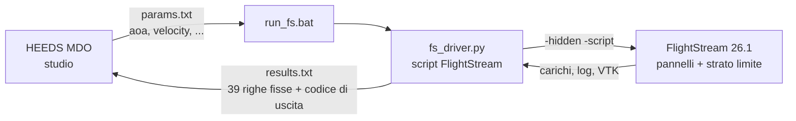
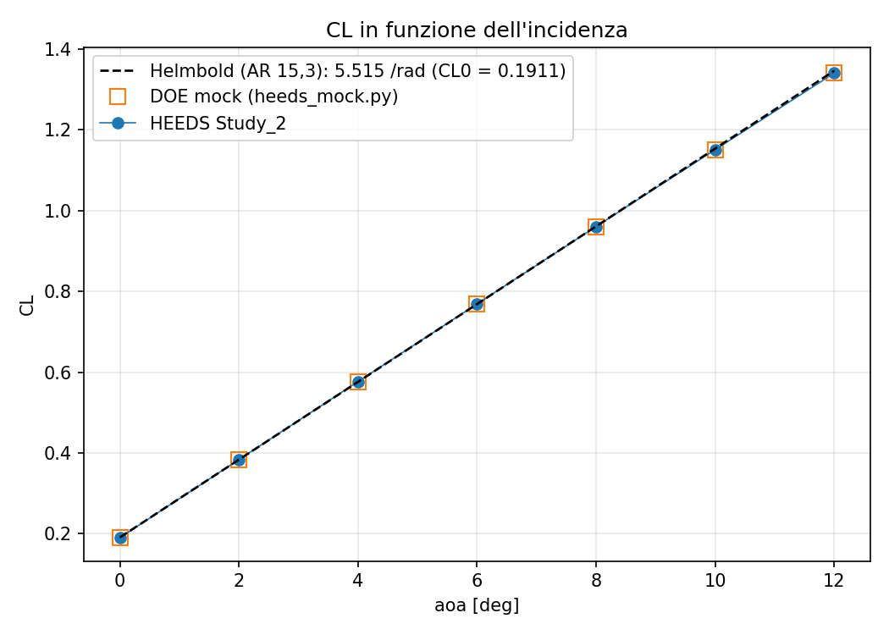
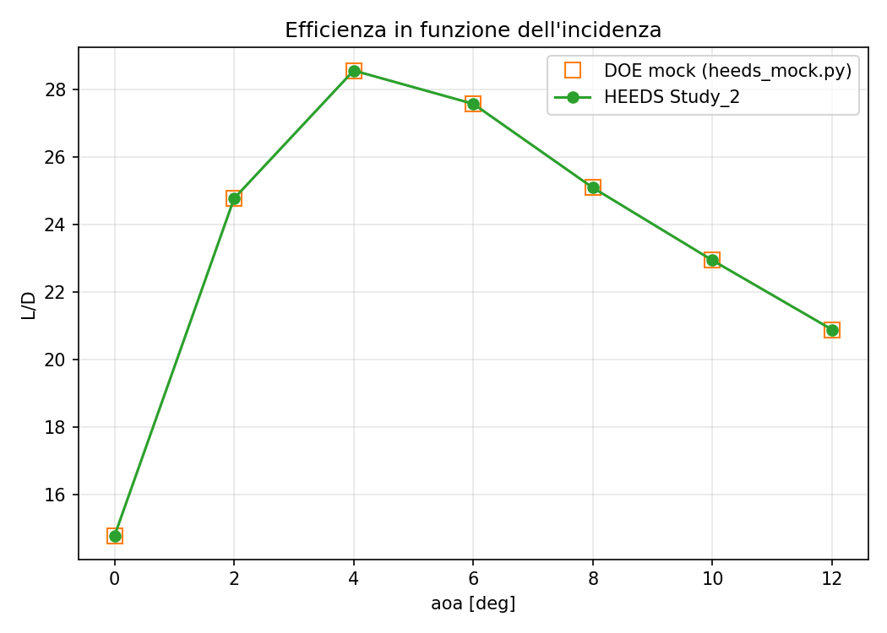

# FlightStream + HEEDS: catena automatica per l'ottimizzazione di una semiala

> Numeri dello Study_2 (sweep HEEDS su aoa, 2026-10-04) verificati con
> `heeds_report.bat --check-against-mock …`: dettaglio in [`demo/verifica_Study_2.md`](demo/verifica_Study_2.md).

## Obiettivo e cosa è stato fatto

Far valutare a **HEEDS MDO** design aerodinamici calcolati con **FlightStream 26.1** senza interventi
manuali, come base per DOE e ottimizzazione. Fatto: driver Python che genera lo script FlightStream,
lo esegue in batch e restituisce i risultati in un formato fisso; validazione contro un run manuale;
gestione degli errori (status, licenza, timeout, processi); due modalità geometriche (`fixed` da `.fsm`,
`ccs_wing` con la corda variabile); collegamento a HEEDS provato con un Evaluation Only e uno sweep su aoa.

## Architettura

La comunicazione avviene **solo tramite file** nella cartella di ogni design: HEEDS scrive
`params.txt`, lancia `run_fs.bat`, legge `results.txt` (stesse 39 righe nello stesso ordine,
`schema_version = 2`) e il codice di uscita (0 = design valido). È automatica per ogni design; il motivo
di un errore è sempre in `run_info.txt`.

## Validazione della catena

| aoa = 4°, V = 20 m/s | CL | CD | CMy | L/D | Re |
|---|---|---|---|---|---|
| Riferimento (run manuale di FlightStream, `riferimento_run_fsm2`) | 0,5767 | 0,0202 | −0,1993 | 28,55 | 474985 |
| Driver da riga di comando (`heeds_mock.py`) | 0,5767 | 0,0202 | −0,1993 | 28,5495 | 474985 |
| HEEDS, Evaluation Only (Study_1) | 0,5767 | 0,0202 | −0,1993 | 28,5495 | 474985 |

Sweep HEEDS su aoa = 0, 2, …, 12° (Study_2, 7 design) confrontato design per design con il DOE del
driver: **VERIFICA OK**, **7/7** design, differenza relativa massima **0** su CL, CD, CMy e L/D (tolleranza
1e-4), 0 design in errore. Tempo per design **31 s** in media (27–40 s): ≈ 30 s di FlightStream, ≈ 1 s di
driver e HEEDS; studio intero 3 min 40 s.

Gestione degli errori provata in HEEDS: un design con codice di uscita ≠ 0 viene **scartato** ("The return
value (1) for the analysis command did not match the specified value (0). This design analysis will be
marked as an error.").

## Risultati

| CL in funzione di α | L/D in funzione di α |
|---|---|
|  |  |

- dCL/dα (0–8°, minimi quadrati): **5,515 /rad** (0,0963 /deg) dallo sweep HEEDS, identico al DOE del
  driver; teoria dell'ala finita (AR = 15,3): Helmbold 5,515 /rad (scarto < 0,01 %), linea portante
  ellittica 5,557 /rad (−0,8 %).
- L/D massimo **28,55 a 4°** tra i punti calcolati (passo 2°).

## Limiti attuali

- Modello **disaccoppiato e senza modello di separazione**: i carichi restano lineari, **nessuno stallo**
  (CL lineare fino a 12°).
- Metriche di separazione (`sep_frac_up_le`, …) calcolate ma **non ancora validate**.
- Reynolds ≈ 4,7·10⁵, **sotto il campo** del modello transizionale (5·10⁵–1,5·10⁶).
- **Una sola variabile geometrica** (`chord_scale`).

## Prossimi passi

2. **Mesh:** studio di convergenza dei pannelli (Mesh_U, Mesh_V) prima di ottimizzare.
3. **XFOIL:** confronto 2D del profilo (CL, transizione, H, cf) allo stesso Re.
4. **Accoppiamento viscoso + separazione:** `viscous_coupling` e `CREATE_AIRFOIL_SEPARATION` per avere lo stallo.
5. **Calibrazione:** confronto con dati di galleria o CFD di riferimento (fonte da definire).
6. **Problema di ottimizzazione:** variabili, vincoli (status, `sep_frac_up_le`) e obiettivo (L/D o L_N/D_N).
7. **API HEEDS:** creare e lanciare gli studi da script Python invece che dalla GUI.
8. **Fusoliera:** modalità `fixed` con le sole metriche generiche (senza `wing_frame`).
