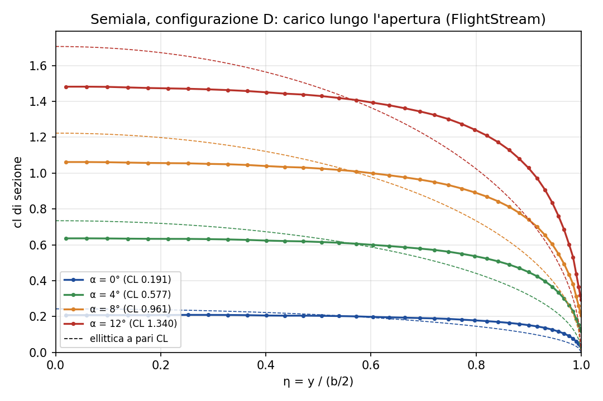

# Semiala con FlightStream + HEEDS: cosa sappiamo fare e cosa no

*Report di chiusura del lavoro sull'ala, v2.6.0 (2026-10-06). Dettagli, comandi e storia delle decisioni in
`STATO.md`; uso della pipeline in `README.md` e `HEEDS_SETUP.md`.*

**In sintesi.** FlightStream, nella configurazione di riferimento (disaccoppiata, senza modello di separazione),
è adatto alle simulazioni rapide della semiala **nel campo lineare**: carichi e pendenza della retta di portanza
sono coerenti con la teoria, ripetibili e convergenti in mesh, con circa 30 s a design. **Non predice lo stallo.**
Gli indicatori di strato limite (H, cf) sono solo qualitativi. Il modello di separazione di FlightStream non è
usabile per quest'ala. La catena con HEEDS è collegata e verificata.

Caso: semiala rettangolare non svergolata, semiapertura 2,64 m, corda 0,345 m, AR 15,3, V = 20 m/s,
Re = 4,7·10⁵, simmetria Mirror, carichi riportati all'ala intera (Sref 1,822 m²).

## 1. FlightStream per le simulazioni rapide: sì, nel campo lineare

| Aspetto | Risultato |
|---|---|
| Tempo | 16–44 s per design (media 31 s nello Study_2 di HEEDS, di cui circa 1 s di driver e HEEDS) |
| Ripetibilità | due run uguali danno file identici byte per byte; la catena riproduce esattamente il run manuale di riferimento (CL 0,5767, CDi 0,0077, CDo 0,0125, CMy −0,1993 a 4°) |
| Pendenza della retta di portanza | dCL/dα (0–8°) = **5,515 /rad**, uguale alla formula di Helmbold per AR 15,3 (5,515 /rad); linea portante ellittica 5,557 /rad (−0,8 %) |
| Convergenza di mesh | carichi inviscidi (CL, CDi, CMy, cl di sezione) entro **1,2 %** fra mesh attuale e mesh fine (34 000 pannelli, 1,5 volte più fitta in ogni direzione) a 4° e 12°. La resistenza d'attrito CDo converge meno: −2,3 % a 4° e −3,8 % a 12°, con incertezza di discretizzazione (GCI) **2,9 % a 4° e 13,8 % a 12°**. Mesh attuale confermata come default |
| Carico lungo l'apertura | cl(η) dai carichi di sezione di FlightStream (40 sezioni); l'integrale riproduce CL entro lo 0,6 %. Carico quasi piatto fino a η ≈ 0,5, più pieno dell'ellittico verso l'estremità; cl di sezione massimo ≈ 1,10 CL (figura sotto) |
| Geometria del bordo d'uscita | la mesh raccorda il bordo d'uscita tozzo del profilo (0,65 % della corda) a partire da x/c ≈ 0,9. Con il bordo tozzo modellato fedelmente CL cala di circa il **4 %** e CMy (in modulo) di circa il **6 %**: è un'**incertezza geometrica sistematica** dichiarata. Default invariato (raccordo), bordo tozzo disponibile come opzione (`te_type: "blunt"`) |

Incertezze da tenere presenti nei confronti fra design: circa 1 % sui carichi inviscidi (mesh), circa 3 % su CDo a
bassa incidenza e oltre il 10 % ad alta incidenza (mesh), circa 4 % su CL e circa 6 % su CMy (bordo d'uscita,
sistematica: sposta tutti i design nello stesso modo).

## 2. Perché FlightStream non predice lo stallo

FlightStream è un metodo a pannelli: la soluzione di base è **inviscida** e la portanza cresce linearmente con
l'incidenza finché la soluzione esiste. Lo strato limite è calcolato a valle, con un metodo integrale. In modalità
disaccoppiata (la nostra di riferimento) non retroagisce sulla pressione. In modalità accoppiata (*Coupled*) lo
strato limite modifica la soluzione solo dove è **attaccato** (spessore di spostamento): la regione separata non è
rappresentata, quindi non c'è la perdita di circolazione che produce lo stallo. Il modello di separazione
(*Airfoil*, criterio di Stratford) **corregge la pressione solo a posteriori**, sulle facce marcate come separate,
dopo che la soluzione è già stata calcolata: cambia la tabella dei carichi ma non la soluzione. Risultato: CL resta
lineare fino a 12° e oltre, e lo status 0 non dice che un punto ad alta incidenza sia fisicamente credibile.

## 3. H e cf come indicatori di separazione: solo qualitativi

- Il VTK esporta lo strato limite calcolato **sul Cp inviscido**, anche nei run accoppiati: cf, H, transizione e
  spessore sono identici cella per cella fra run disaccoppiato e accoppiato, mentre il Cp cambia.
- La transizione tende a essere **anticipata**: il modello TRANSITIONAL è usato a Re 4,7·10⁵, sotto il suo campo
  dichiarato (5·10⁵–1,5·10⁶), e non rappresenta la bolla laminare.
- Gli indicatori dipendono molto dalla mesh: la frazione separata vicino al bordo d'attacco a 12° cambia del 10 % fra
  mesh media e fine, la posizione di separazione di oltre il 100 %.
- **Non sono validati.** Per usarli come vincolo serve un riferimento esterno (galleria o CFD), fuori da questa fase.
  Fino ad allora vanno letti come tendenza, non come soglia.

## 4. Modello di separazione di FlightStream: non usabile per quest'ala

Provato in v2.5.0–v2.5.1 (accoppiato e disaccoppiato, Re 4,7·10⁵ e 5,2·10⁵, strato limite turbolento, separazione
laminare, resistenza indotta da pressione):

- il **18 % del dorso risulta separato già a 0°** (48 % a 4°), da subito dopo la transizione, in ogni variante:
  dipende dal criterio, non dal Reynolds né dal tipo di strato limite;
- la correzione **fa aumentare CL** prima del massimo (a 12°: 1,235 contro 1,153 senza separazione), perché toglie
  recupero di pressione sul dorso senza toccare il picco al bordo d'attacco;
- **non produce resistenza** con la resistenza indotta calcolata dalla vorticità (default); con quella da pressione
  sì, ma il risultato non è verificabile.

Il modello resta nel codice come opzione (default `none`) e **non va usato in HEEDS**. I JSON di prova sono in
`configs/esplorativi/`.

## 5. HEEDS: collegato e verificato

- **Study_1** (Evaluation Only): un design, risultati uguali al run manuale.
- **Study_2** (sweep su α 0–12°, 7 design): verificato design per design contro il DOE del driver, scarto 0.
- **Test di errore**: un design con codice di uscita ≠ 0 viene scartato da HEEDS. Il motivo è sempre scritto in
  `run_info.txt` (status 1 setup, 2 timeout, 3 non convergente, 4 post-processing parziale, 5 non fisico,
  6 licenza o FlightStream già aperto).
- **Rivalutazione dei design falliti per cause esterne** (status 2 o 6, ad esempio il blocco occasionale di
  FlightStream dopo la convergenza): procedura *Share designs* del manuale HEEDS (p. 9-33), descritta in
  `HEEDS_SETUP.md`; la creazione dei set di POST nella GUI è ancora da provare.
- **Collaudo finale v2.6.0** (`run_fs.bat`, stessi comandi di HEEDS): 10 design, tutti status 0 (fixed a
  α 0–12° con passo 2°; `ccs_wing` con chord_scale 0,9 / 1,0 / 1,1 a 4°). Le righe 2–39 di `results.txt` sono
  **identiche** allo Study_2 e al DOE ccs precedente (differenza massima 0; portanza 235,8 / 257,4 / 278,8 N). La
  verifica dello Study_2 con `heeds_report` risulta ancora OK. Controlli automatici: 52 test e preflight verdi.
- `results.txt` ha 49 righe a posizione fissa (schema 4). Le righe già taggate in HEEDS non si spostano: le
  aggiunte stanno sempre in fondo (carico lungo l'apertura nelle righe 46–49).

## 6. Proposta di problema SHERPA (da discutere, non eseguito)

- **Obiettivo:** minimizzare la resistenza `D_N` (riga 14).
- **Vincoli:** `L_N` (riga 13) ≥ peso W; `status` = 0. **Il peso W va chiesto al team.**
- **Variabili:** `aoa` (0–12°) e `chord_scale` (0,9–1,1), modalità `ccs_wing`.
- In newton, non in coefficienti: con `chord_scale` cambia la superficie di riferimento.

**Da dichiarare:** senza un vincolo di stallo l'ottimo tende a finire **sul limite delle variabili**. Il metodo non
vede lo stallo, quindi incidenze alte con corde piccole risultano "convenienti". Proposte da discutere: un limite
superiore su `aoa` più prudente (ad esempio 8–10°), oppure un vincolo sul cl di sezione massimo (`cl_sec_max`, riga 46)
sotto un valore preso da dati del profilo. Inoltre la CDo, che pesa sulla resistenza a bassa incidenza, ha
un'incertezza di mesh di qualche percento: differenze di resistenza fra design inferiori a circa il 3 % non sono
significative.

## 7. Cosa resta aperto

- **Stallo:** non predicibile con questo metodo (§2). Serve un modello o un riferimento diverso.
- **Validazione esterna:** galleria o CFD di riferimento per carichi, CDo e indicatori di strato limite.
- **Fusoliera:** FlightStream è utile per pressioni e momenti nel flusso attaccato e per l'interferenza
  ala–fusoliera. Non dà la resistenza di pressione (paradosso di d'Alembert), e il modello *axial vortex* non è
  testato: serve un riferimento RANS.
