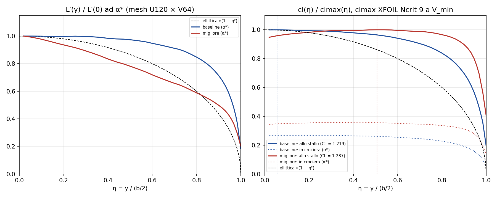

# 7H – verifica del design migliore SHERPA (generato da analisi_7h.py)

Studio HEEDS `semiala_planform_full` (150 valutazioni), design migliore = **Design129** ("LatestBest"): params.txt esatto c_root 0,287040, taper 0,508000, twist_tip_deg −0,440000, b_half 3,03072. Baseline: c_root 0,345091293, taper 1, twist 0, b_half 2,64. Run con `run_fs.bat` come HEEDS, trim W = 147,15 N, clmax XFOIL Ncrit 9. Mesh U120 × V64 (studio) e U180 × V64 (growth in corda 1,0656).

## 1. Risultati

| mesh | design | status | D_N | Di_N | D0_N | e_span | alpha_trim | CLmax_wing | CL_req | stall_margin | eta_stall | Re_tip | M_root_Nm |
|---|---|---|---|---|---|---|---|---|---|---|---|---|---|
| U120V64 | baseline | 0 | 6,5589 | 1,1373 | 5,4216 | 0,8875 | 1,440 | 1,2193 | 0,9156 | 0,3316 | 0,059 | 474985 | 89,61 |
| U120V64 | migliore | 0 | 4,9074 | 0,8143 | 4,0932 | 0,9404 | 2,501 | 1,2868 | 1,2717 | 0,0119 | 0,506 | 200702 | 95,67 |
| U180V64 | baseline | 0 | 6,7542 | 1,1263 | 5,6279 | 0,8963 | 1,397 | 1,2197 | 0,9156 | 0,3321 | 0,059 | 474985 | 89,69 |
| U180V64 | migliore | 0 | 5,0232 | 0,8056 | 4,2176 | 0,9502 | 2,456 | 1,2860 | 1,2717 | 0,0112 | 0,572 | 200702 | 95,68 |

Controllo con lo studio HEEDS (stesso design, stessa mesh): D_N 4,90745 contro 4,90745, stall_margin 0,01186 contro 0,01186.

## 2. Δ = migliore − baseline

| mesh | ΔD_N [N] | ΔD_N [%] | ΔDi_N [N] (%) | ΔD0_N [N] (%) | stall_margin baseline / migliore |
|---|---|---|---|---|---|
| U120V64 | −1,6514 | −25,18 % | −0,3230 (−28,4 %) | −1,3284 (−24,5 %) | 0,3316 / 0,0119 |
| U180V64 | −1,7310 | −25,63 % | −0,3207 (−28,5 %) | −1,4103 (−25,1 %) | 0,3321 / 0,0112 |

**Criterio (stesso segno su entrambe le mesh e |ΔD_N| > 3 % sulla mesh fine): SUPERATO** (segno uguale; ΔD_N fine −25,63 %).

## 3. Sensibilità allo stallo: clmax XFOIL Ncrit 5 (mesh U120 × V64, solo post-processing)

clmax(Re) Ncrit 5 da `xfoil/polars` → `xfoil/clmax_vs_Re_N5.csv` (non attivo): 1.0e5: 1,224, 1.5e5: 1,262, 2.0e5: 1,294, 2.5e5: 1,326, 3.0e5: 1,354, 4.0e5: 1,407, 5.0e5: 1,453, 6.0e5: 1,489, 8.0e5: 1,545.

| design | CL_req | CLmax_wing Ncrit 9 (ricalcolo) | stall_margin Ncrit 9 | η_stall | CLmax_wing Ncrit 5 | stall_margin Ncrit 5 | η_stall |
|---|---|---|---|---|---|---|---|
| baseline | 0,9156 | 1,2193 | 0,3316 | 0,059 | 1,2172 | 0,3294 | 0,059 |
| migliore | 1,2717 | 1,2868 | 0,0119 | 0,506 | 1,2384 | −0,0262 | 0,572 |

**stall_margin del migliore con Ncrit 5 = −0,0262: NEGATIVO: il design non è ammissibile con Ncrit 5**.

## 4. Carico in apertura

Sinistra: L′(y)/L′(0) ad α* (L′(0) = sezione a η ≈ 0,02) contro l'ellittica. Destra: cl/clmax lungo l'apertura alla condizione di stallo (CL dell'ala = CLmax_wing; il massimo vale 1 a η_stall, linea tratteggiata verticale) e in crociera (punteggiato).
